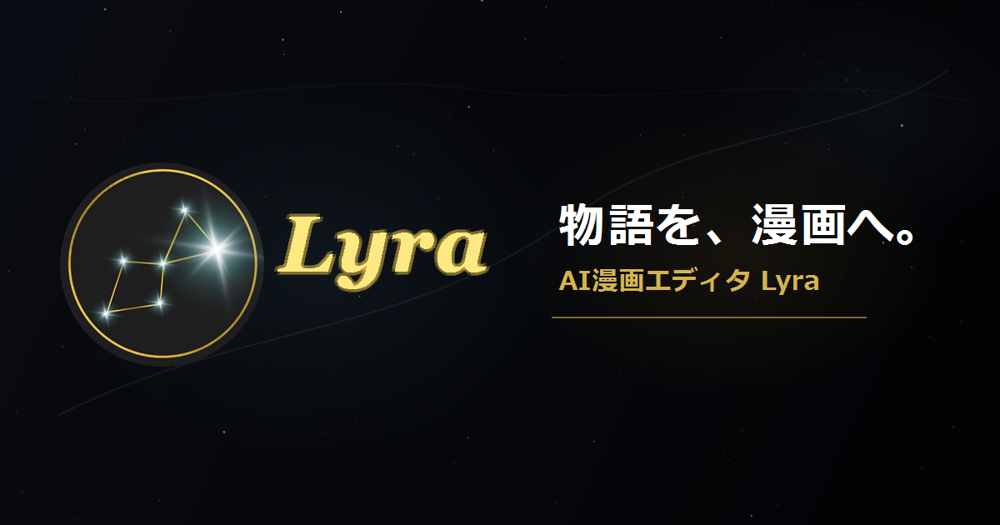
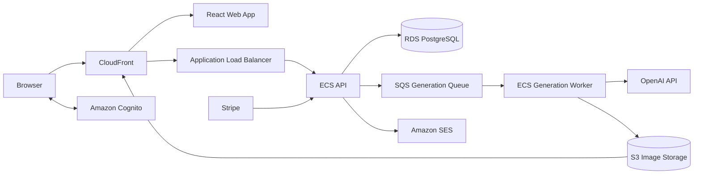

# Lyra

[](https://github.com/sh0g0-ikeda/Lyra/actions/workflows/ci.yml)



**物語を、編集可能な漫画ページへ変換するAI漫画制作エディタです。**

Lyraは、小説やプロットをそのまま1枚の画像にするのではなく、物語をページとコマへ分解し、登場人物、状況、構図、カメラ、背景、セリフを編集できる状態にしてから漫画を生成します。

[公開デモを開く](https://app.lyra-editor.com) | [3分でわかる操作手順](#基本的な使い方) | [ローカルで起動する](#ローカル開発)

> 公開デモの利用にはアカウント登録が必要です。AI処理と画像生成には数分かかる場合があります。

## Lyraが解決する課題

一般的な画像生成だけで複数ページの漫画を作ろうとすると、次の作業を人が毎回やり直す必要があります。

- 長い物語を、ページごとの出来事に分ける
- 各ページを、意味のあるコマへ分ける
- コマごとに登場人物、構図、カメラ、背景を指定する
- 誰が何を話すかを整理する
- キャラクターの見た目と前後の場面を揃える
- 生成結果を見て、直したい箇所だけ再指定する

Lyraは、この間に**編集可能な漫画設計データ**を置きます。AIにすべてを任せ切らず、生成前に人が確認して修正できることが特徴です。

| 従来の一括生成 | Lyra |
| --- | --- |
| 入力からすぐ画像を生成する | 物語をページとコマへ構造化してから生成する |
| 失敗した理由を確認しにくい | 登場人物、状況、構図、セリフをコマ単位で確認できる |
| 修正時に長いプロンプトを書き直す | 直したい入力欄だけ変更して新規生成できる |
| ページ間のつながりを人が管理する | 話全体を参照してページへの分散と重複を監査する |

## 主な機能

### ストーリー設計

- 作品、章、話を整理して執筆
- StoryAIによる文章の改善と構成支援
- 話全体を指定ページ数へ分散し、ページとコマの骨格を生成
- ページを横断した出来事、場面転換、重複の確認

### キャラクター管理

- 外見や特徴をGUIで設定
- 手持ち画像の取り込み、全身プレビューの生成、参照画像の確定
- 確定したキャラクター画像をページ生成時の参照として利用
- 別名や通称を登録し、物語中の表記揺れを同じ人物として扱う

### ページとコマの編集

- コマ割りテンプレートの選択とプレビュー
- コマの追加、削除、並び替え
- 登場人物、状況、構図、ショット、アングル、背景、効果音、セリフを個別に編集
- 日本の漫画に合わせた右から左、上から下の読書順

### 生成と出力

- 保存済みの最新入力から、ページ画像を新規生成
- 生成ジョブの進捗、失敗、再試行を管理
- 選択したページまたは全ページを、画像またはPDFで書き出し
- 日本語と英語のUI、ストーリー、セリフ生成に対応

## 基本的な使い方

```text
作品を作成
  -> 章と話を追加してストーリーを書く
  -> 登場人物を作り、参照画像を確定する
  -> ページ骨格を生成する
  -> 話全体をページとコマへ反映する
  -> コマごとの情報を確認、修正する
  -> ページ画像を生成する
  -> 画像またはPDFで書き出す
```

1. **作品を作成する**: タイトルとジャンルを入力します。
2. **章と話を追加する**: 漫画にしたいストーリーを話単位で入力します。シーン情報は任意です。
3. **キャラクターを登録する**: 外見を設定し、生成または取り込んだ画像から参照画像を確定します。
4. **ページ骨格を生成する**: ページ数と物語に応じて、ページとコマの大枠を作ります。
5. **話全体を反映する**: AIが物語をページへ分散し、各コマの登場人物、状況、構図、背景、セリフを埋めます。
6. **人が最終調整する**: 読み順や会話の流れを確認し、必要な項目だけ修正します。
7. **ページを生成する**: 最新の保存内容と確定済みキャラクター画像を使って、新しいページ画像を生成します。
8. **作品を書き出す**: 必要なページを選択し、画像またはPDFで保存します。

## ハッカソンで見てほしい点

### 1. 画像生成の前に、人が介入できる

Lyraの中心は画像生成ボタンではありません。ストーリーと画像の間に、ページとコマの編集画面があります。AIの判断を確認し、必要な箇所だけ直してから生成できます。

### 2. 漫画制作に必要な情報を構造化している

ストーリーを単純に短く要約するのではなく、各コマについて次の情報を分けて保持します。

- そのコマで伝える出来事
- 登場するキャラクター
- 全体構図、ショット、カメラアングル
- 背景と演出
- セリフの内容と話者

この構造はUI、保存データ、画像生成プロンプトまで一貫して使われます。

### 3. 複数ページを話全体として扱う

ページごとに独立して考えるだけでは、同じ場面やセリフが繰り返されます。Lyraは話全体を先にページへ分散し、ページを横断して出来事の重複、場面転換、セリフの配置を確認します。

### 4. キャラクターの一貫性を画像で支える

キャラクターは文章だけで管理せず、ユーザーが確定した参照画像を生成時に添付します。どのコマに誰が登場するかも、保存済みのコマ情報から明示します。

### 5. 時間のかかる処理を安全に扱う

ページ骨格、話全体の反映、画像生成は非同期ジョブとして管理します。ジョブの重複防止、タイムアウト、再試行、失敗時のクレジット返却を分離し、長い外部API処理が通常の編集操作を塞がない構成です。

## システム構成



編集APIと時間のかかる生成処理を分離しています。APIは入力検証、認証、認可、クレジット、ジョブ投入を担当し、Workerが外部AIと画像保存を担当します。

## 技術スタック

| 領域 | 技術 |
| --- | --- |
| Web | React 19, TypeScript, Vite, TanStack Query, React Router |
| API | Bun, Hono, TypeScript, Zod |
| Database | PostgreSQL |
| AI | OpenAI Structured Outputs, OpenAI Image Generation |
| Async jobs | Amazon SQS, ECS Worker |
| Cloud | CloudFront, ALB, ECS Fargate, RDS, S3, Cognito, SES, Secrets Manager |
| Billing | Stripe Checkout, Customer Portal, Webhook |
| Quality | Vitest, Bun test runner, Playwright, ESLint, GitHub Actions |

## リポジトリ構成

```text
apps/web/            Reactフロントエンド
src/routes/          HTTP入力、認証、認可、レスポンス
src/services/        ストーリー、ページ、生成、課金のワークフロー
src/repositories/    PostgreSQLへの永続化
src/domain/          ドメイン型、定数、純粋ロジック
src/infrastructure/  OpenAI、AWS、Stripeなどの接続実装
scripts/             マイグレーション、Worker、管理コマンド
migrations/          PostgreSQLマイグレーション
tests/               Unit、Integrationテスト
apps/web/e2e/        Playwrightブラウザテスト
docs/                仕様、設計、運用資料
ops/                 AWSとセキュリティ設定例
```

## ローカル開発

AI生成を無効にした状態なら、外部APIの料金を発生させずに画面と編集機能を確認できます。

### 必要な環境

- Git
- [Bun](https://bun.sh/) 1.3以降
- Node.js 22以降とnpm
- Docker Desktop

### 1. 取得と依存関係のインストール

```powershell
git clone https://github.com/sh0g0-ikeda/Lyra.git
cd Lyra
bun install --frozen-lockfile
npm --prefix apps/web ci
```

### 2. PostgreSQLの起動

```powershell
bun run db:up
```

Docker ComposeがローカルにPostgreSQLを作成します。

| 項目 | 値 |
| --- | --- |
| Host | `127.0.0.1` |
| Port | `5432` |
| Database | `lyra` |
| User | `postgres` |
| Password | `postgres` |

### 3. ローカル環境変数の作成

```powershell
Copy-Item .env.example .env
Copy-Item apps/web/.env.example apps/web/.env
```

ルートの `.env` でローカル認証を有効にします。

```env
APP_ENV=development
DEV_AUTH_BYPASS=true
DEV_AUTH_BYPASS_EMAIL=dev@local.lyra
GENERATION_ENABLED=false
```

`apps/web/.env` では次を有効にします。

```env
VITE_API_PROXY_TARGET=http://localhost:3000
VITE_DEV_AUTH_BYPASS=true
VITE_DEV_AUTH_BYPASS_EMAIL=dev@local.lyra
```

### 4. Databaseの初期化

```powershell
bun run migrate
```

### 5. APIとWebの起動

2つのターミナルで、それぞれ実行します。

```powershell
# Terminal 1: API
bun run dev
```

```powershell
# Terminal 2: Web
bun run web:dev
```

ブラウザで [http://127.0.0.1:5173](http://127.0.0.1:5173) を開きます。

### ローカルでAI生成も試す場合

ルートの `.env` に有効なOpenAI APIキーを設定し、生成を有効にしてAPIを再起動します。

```env
GENERATION_ENABLED=true
OPENAI_API_KEY=your-local-key
LOCAL_FILE_STORAGE_DIR=.localdata/assets
LOCAL_ASSET_BASE_URL=http://127.0.0.1:3000/local-assets
```

この設定ではプロバイダー料金が発生します。`.env` はコミットせず、公開環境の認証情報をローカルへ貼り付けないでください。

## テスト

CIは、バックエンド、Database、フロントエンド、ブラウザの各層を検証します。

```powershell
# Unit / Integration
bun run test
bun test

# Database contract
bun run migrate
bun run db:check-invariants

# Backend
bun run build

# Frontend
bun run web:lint
bun run web:build

# Browser smoke test
bun run web:e2e
```

## 詳細ドキュメント

- [統合仕様](docs/Lyra_Unified_Spec_v4.md)
- [StoryAI詳細仕様](docs/Lyra_StoryAI_SubSpec.md)
- [本番運用Runbook](docs/phase9-production-runbook.md)
- [クラウド構成](docs/cloud-current-state-2026-06-21.md)
- [Lyraを題材にしたDocker入門](docs/docker-learning-lyra.md)

## 注意事項

- AIの出力は確率的です。生成前にコマ情報を確認し、最終成果物は利用者が確認してください。
- 生成と再生成は、現在保存されている入力から新しい画像を作ります。以前の生成画像を暗黙の参照にはしません。
- シーン入力は補助情報であり、未入力でもページ骨格を作成できます。
- 本番環境のシークレット、課金、認証、画像配信、Worker設定は、READMEではなく統合仕様とRunbookを正として管理します。

---

Lyraは、AIに漫画制作を丸投げするためのツールではなく、**人が物語と演出を制御しながら、漫画制作の反復を速くするためのエディタ**です。
