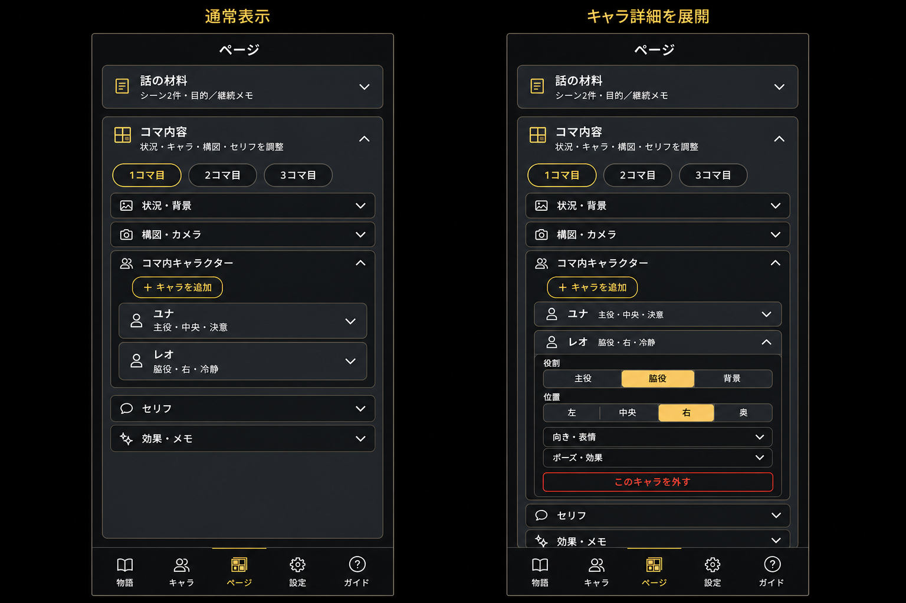

# Mobile ページ編集 UI 改善設計

作成日: 2026-08-15
対象: iOS / Android 共通 React Native UI

## 1. 目的と範囲

ページ編集画面の縦方向の長さと視覚階層を改善し、次の3点を実現する。

1. 「構図ソース」の選択 UI を非表示にし、新規コマでは既存の `ai_auto` 既定値を使う。
2. コマに追加したキャラクターの詳細入力を、キャラクターごとに折りたためるようにする。
3. 「話の材料」「コマ内容」などの大きな編集ブロックを最奥背景から明確に分離し、文字のコントラストを上げる。

対象は Mobile UI 層だけとする。iOS と Android は同じ `PagesScreen` と共通コンポーネントを使うため、同一の画面構成・操作にする。

## 2. 非対象

- Route / Service / Repository / DB / Worker の変更
- API endpoint、request / response schema、保存順序の変更
- 認証、認可、organization scope、クレジット、生成ジョブの変更
- dirty-state、query key、cache invalidation の変更
- 既存の gallery / custom 構図データの一括変換
- Web UI の変更

## 3. Spec 根拠

- `docs/Lyra_Unified_Spec_v4.md` 2章: ユーザーは状況、構図、カメラ、背景、セリフを確認してからページ画像を生成する。
- 同 3章: Mobile の表示責任は app 層に留め、バックエンド境界を越えない。
- 同 6章: 生成は現在保存済みの入力を使い、既存入力を暗黙に破壊しない。
- `docs/mobile_frontend_design.md` 8.8〜8.10、9.5、10.4、13.4、22.3: ページ・コマ・人物割当の既存保存順と生成前保存を維持する。

## 4. 現状と判断

### 4.1 構図ソース

`PagesScreen` の新規コマ用 `compositionSource` はすでに `ai_auto` で初期化されている。既存コマを選択した場合は、サーバーから取得した `gallery` / `custom` / `ai_auto` をローカル state に復元し、同じ値を保存 payload に戻している。

したがって、今回削除するのは次の表示だけとする。

- 「構図ソース」ラベル
- `AI自動 / ギャラリー / 自由指定` の SegmentedControl
- gallery 選択時の CompositionPicker

`compositionSource` state、既存値の hydrate、dirty 判定、payload、gallery ID 検証は残す。

これにより、新規コマは `ai_auto`、既存の gallery / custom コマは従来値のままとなる。既存コマを開いた時点で `ai_auto` に上書きしてはならない。別項目を保存しただけで過去の生成入力が変わるためである。

構図メモ、ショット、アングル、自由メモは従来どおり表示・保存する。

### 4.2 キャラクター詳細

現在はキャラクター1人につき、役割、位置、向き、表情、ポーズ、効果、状態を常時表示している。この本文だけをキャラクター単位の Disclosure に移す。

折りたたみ時に表示する情報:

- キャラクター名
- `役割・位置・表情` の要約
- 展開状態を示す Chevron

展開時に表示する情報:

- 役割
- 位置
- 向き
- 表情と自由表情
- ポーズと自由ポーズ
- 効果メモ
- 連続性状態の詳細
- `このキャラを外す`

初期状態は次のとおりとする。

- サーバーから読み込んだ既存キャラクター: 折りたたみ
- 新しく追加したキャラクター: 追加直後だけ展開
- コマを切り替えた場合: 切替先のキャラクターは折りたたみ

展開状態は UI ローカル state とし、assignment payload、dirty 判定、保存結果には含めない。折りたたんでも未保存入力は保持する。

見出し全体は44pt以上のタップ領域とし、`accessibilityRole="button"` と `accessibilityState={{ expanded }}` を設定する。

### 4.3 大きな編集ブロック

最奥背景は `#050505` まで暗くし、編集ブロックには明度差の大きい raised tone を適用する。

| 階層 | 色 | 用途 |
|---|---|---|
| 最奥 | `#050505` | 画面背景 |
| 大ブロック | `#292D34` | 話の材料、コマ内容 |
| 内部区分 | `#1C2026` | 状況・背景、構図・カメラ、キャラクター等 |
| キャラクター要約 | `#252A31` | 名前、役割・位置・表情の要約 |
| 入力欄 | `#343A44` | FormField / SegmentedControl |

大ブロックの境界には `#5A5138`、見出しには `#FFFFFF`、補助文には `#D0D3D8` を使う。黄色は選択状態、Chevron、重要操作だけに限定する。最奥と大ブロックの明度差を十分に取り、境界線だけに頼らず塗り面そのものでも階層を判別できるようにする。

`Section` に専用 tone を追加し、`pages:story-sources` と `pages:panels` に適用する。最奥背景と入力面は共通 theme token を更新して全モバイル画面で統一し、`raised` と内部カードの追加は編集密度が高いページ編集ブロックだけを対象にする。

`PanelEditorSections` の5区分は罫線だけで分けず、個別の塗り付きカードにする。

## 5. 改善後の画面

左は通常状態、右は「レオ」の詳細を展開した状態である。構図ソース選択は存在せず、構図・カメラ区分には構図メモ、ショット、アングル等だけが入る。

## 6. 操作と対応する挙動

| 操作 | 表示上の挙動 | データ・通信 |
|---|---|---|
| 新しいコマを作成 | 構図ソース選択を表示しない | 従来どおり `source: ai_auto` を含む同じ payload を送る |
| 既存コマを開く | source が何であっても選択 UI は表示しない | hydrate した既存 source を保持し、保存時も同じ値を送る |
| キャラを追加 | 新しいキャラ行だけ展開する | 現行 defaults を assignment state に追加する |
| キャラ行をタップ | 詳細を展開／折りたたみする | API 呼び出しなし、dirty 状態も変えない |
| 役割・位置等を変更 | ヘッダー要約へ即時反映する | 現行 assignment state を更新する |
| `このキャラを外す` | 詳細を閉じ、既存Undo表示を出す | 現行 remove / undo 処理を使う |
| 大ブロック見出しをタップ | 内容を展開／折りたたみする | 現行 Section の保存済み開閉状態だけを更新する |
| コマを保存・生成 | 表示の開閉状態に関係なく全入力を保存する | 現行 save / generate、query invalidation、job trackingを変更しない |

## 7. 実装ファイル

- `apps/mobile/src/screens/PagesScreen.tsx`
  - 構図ソース選択表示の削除
  - AssignmentEditor の個別 Disclosure
  - 対象 Section への raised tone 指定
- `apps/mobile/src/components/PanelEditorSections.tsx`
  - 内部区分のカード化と文字コントラスト
- `apps/mobile/src/components/PanelCharacterAssignmentCard.tsx`
  - キャラクター要約と詳細のDisclosure
- `apps/mobile/src/components/Section.tsx`
  - 編集ブロック専用 tone
- `apps/mobile/src/constants/theme.ts`
  - 編集ブロック用の色token

API client、backend、domain type は変更しない。

## 8. テストと検証

実装前に失敗テストを追加し、以下の契約を検証する。

1. 新規コマの payload が従来どおり `source: 'ai_auto'` である。
2. 構図ソース SegmentedControl と CompositionPicker が描画されない。
3. 既存 gallery / custom コマの別項目を編集しても source、gallery ID、custom note が保持される。
4. キャラ行は初期状態で閉じ、名前と役割・位置・表情要約が表示される。
5. 新規追加したキャラだけが開き、開閉操作だけでは assignment 値と dirty 状態が変わらない。
6. 展開後、既存の全入力と削除・Undoが使える。
7. iOS / Android 共通の44ptタップ領域と accessibility expanded state を確認する。
8. `pageAtomicGeneration` 系テストで、非表示になった構図 source が保存・生成 payload から欠落しないことを確認する。
9. iPhone 375×812、390×844とAndroid 360×800で表示崩れ、文字切れ、キーボード時スクロールを確認する。

自動検証では、Mobile全128 test files / 591 tests、TypeScript、ESLint、API contract、文字化け検査を通過した。さらにExpoのiOS / Android bundle exportを実行し、両プラットフォームでbundle生成できることを確認した。端末寸法ごとの最終目視は次の実機ビルドで行う。

## 9. セキュリティと残存リスク

認証、認可、テナンシー、入力上限、SQL、シークレット、クレジットには触れない。

残存リスクは、過去データに `source: gallery` かつ `gallery_item_id` なしの不整合が存在する場合、非表示UIからユーザーが修復できない点である。既存の検証を緩めたり自動変換したりせず、リリース前にfixtureと実データの件数確認を行い、該当があれば別のデータ修復計画として扱う。

## 10. Sol / Terra

- Sol: UI境界、互換方針、構図・キャラクター操作、テスト、最終統合レビューを担当。
- Terra: theme、Section、PanelEditorSectionsの限定実装と対象検証を担当。
- Route / Service / Repository / API clientは変更せず、Mobile UIだけを実装した。
