# UIフィードバック｜改善案

- 作成日：2026-09-29
- 対象：漫画作成アプリ（モバイル）
- 本書の位置づけ：『UIフィードバック｜全体共通項目』『UIフィードバック｜画面・フロー単位』で挙げた指摘に対する改善案。ワイヤーフレームと設計意図を記載する
- 前提：本書のワイヤーは構造と情報設計を示すものであり、配色・タイポグラフィ・余白等のビジュアル指定は含まない

---

## 1. 本書の読み方

各改善案は次の構成で記載する。

| 項目 | 内容 |
|------|------|
| 対応する指摘 | 『画面・フロー単位』ドキュメントの指摘ID |
| ワイヤー | 改善後の画面 |
| 変更点 | 現状からの差分 |
| 設計意図 | なぜその形にしたか |
| 根拠 | 依拠したUI原則・現象 |

指摘IDと改善案の対応は 6章の一覧を参照。改善案でカバーしていない指摘は 7章に分離して記載する。

---

## 2. 改善案の全体像

### 2.1 ナビゲーション構造の変更

**現状**

```
物語 / キャラ / ページ / 設定 / ガイド（5タブ）
　└ 漫画1本の制作に「物語 → キャラ → ページ」の3タブを順に使用する
```

**改善案**

```
漫画 / アセット / マイページ / ガイド（4タブ）
　└ 漫画制作は「漫画」タブ内で完結し、ステップで進行する
　　　ストーリー → キャラクター → ページ
　　　　　　　　　　　　　　　　　　└ ページ設計 → 設定の入力 → ページ作成
```

**変更の要点**

1. **制作工程を1タブへ統合**：順序を持つ工程を、並列のタブではなくステップ進行で表現する
2. **キャラクターを「アセット」へ移動**：話ごとの設定ではなく、再利用可能な資産として扱う
3. **タブの役割を整理**：`漫画`＝制作、`アセット`＝素材の管理、`マイページ`＝アカウント・設定、`ガイド`＝ヘルプ

**根拠**
- 情報アーキテクチャにおける構造の一致：ナビゲーション構造はタスク構造と一致させる。並列構造（ハブ型）と逐次構造（ウィザード型）は異なるコンポーネントで表現する
- Material Design / Human Interface Guidelines：ボトムナビゲーションは同階層・並列な目的地の切り替えに使用し、順序を持つ工程にはステップ型UIを使用する

---

### 2.2 全画面に共通する変更

| 変更 | 内容 | 対応する指摘 |
|------|------|------------|
| トークン残高の常時表示 | 全画面のヘッダー右上に `☆ 30` を配置 | 5.1 |
| プライマリーボタンは1画面1つ | 最も推奨する操作のみ黒（プライマリー）、他は白枠（セカンダリー） | 5.2 |
| 主要ボタンを画面下部へ | 画面右上のアイコンボタンに依存しない配置とする | 3.2 |
| 入力欄にプレースホルダー | 期待する記述粒度・形式を例示する | 3.3 |
| ステップインジケーター | 現在地と残り工程を常時表示する | 2.1 / 3.5 |

---

## 3. オンボーディング・漫画一覧

### 3.1 チュートリアル（初回起動時）

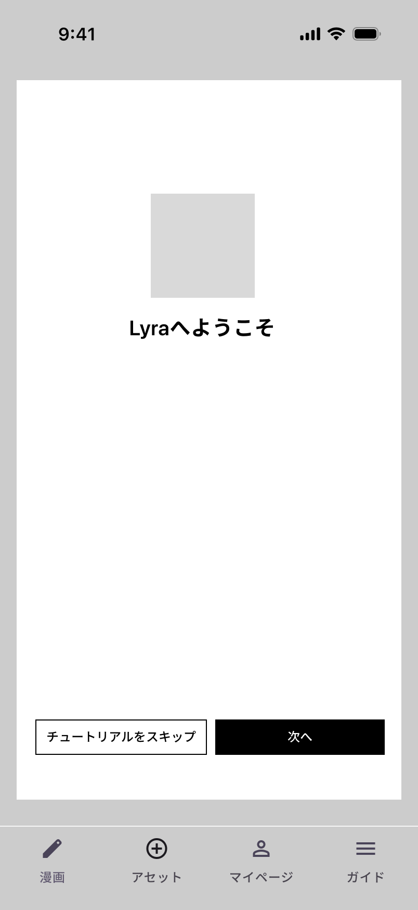

| 項目 | 内容 |
|------|------|
| 対応する指摘 | 2.1（制作手順の提示が制作中のUIと接続されていない） |
| 優先度 | 高 |

**変更点**
- 初回起動時にダイアログを表示し、アプリの使い方と漫画制作の手順を提示する
- `チュートリアルをスキップ`（セカンダリー）／`次へ`（プライマリー）の2択
- ヘッダーに `☆ 30` を表示

**設計意図**
現状は制作手順の説明がログイン前画面に一度表示されるのみで、ログイン後のUIから参照できない。初回起動時にダイアログとして提示することで、制作開始前に全体像を把握できる状態をつくる。スキップを用意し、2回目以降の利用者の妨げにはしない。

**根拠**
- Nielsen のユーザビリティ10原則「ヘルプとドキュメント」：利用者が必要とする時点で実行手順を具体的に提示する
- Nielsen のユーザビリティ10原則「記憶ではなく認識を」：手順の記憶を要求しない
- Nielsen のユーザビリティ10原則「柔軟性と効率性」：習熟者が手順を省略できる経路を併設する

---

### 3.2 漫画一覧（空状態）

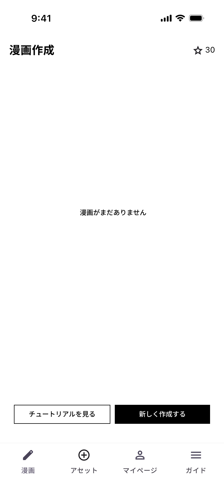

| 項目 | 内容 |
|------|------|
| 対応する指摘 | 3.1（空状態に次の操作へ進むボタンが存在しない）／3.2（右上のアクションボタンがステータスバーと重なる）／5.1（トークンの不可視）／5.2（ボタンの優先順位） |
| 優先度 | 高 |

**変更点**
- 空状態の表示「漫画がまだありません」を画面中央に配置
- 画面下部に `チュートリアルを見る`（セカンダリー）／`新しく作成する`（プライマリー）を配置
- 制作開始の導線を、画面右上の `＋` から画面下部のボタンへ移動
- ヘッダーに `☆ 30` を表示

**設計意図**
現状の空状態は「右上の＋から作成できます」というテキストのみで、操作可能な要素が画面内に存在しない。加えて、その `＋` は端末のステータスバーと重なり押下が困難だった。空状態から1タップで制作を開始できる導線を画面内に設け、同時に押下困難な位置への依存を解消する。

チュートリアルへの導線を併置し、手順が分からない状態のまま制作を開始することを避けられるようにする。プライマリーは「新しく作成する」1つとし、推奨する行動を明示する。

**根拠**
- 空状態（empty state）の設計原則：空状態は「情報がない」ことの表示ではなく、次の行動を開始させる画面として扱う
- Fitts の法則：対象までの距離が大きいほど、また対象が小さいほど到達時間が増加する。画面隅の小面積アイコンは不利にあたる
- セーフエリア：操作可能要素はシステムUI領域外に配置する
- 視覚的階層：プライマリーは1画面1つとし、最も推奨する操作に割り当てる

---

### 3.3 漫画一覧（作品あり）

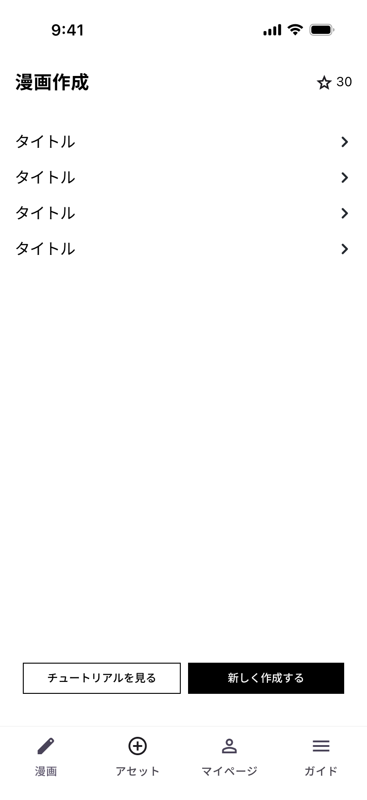

| 項目 | 内容 |
|------|------|
| 対応する指摘 | 3.1 / 3.2 / 5.1 / 5.2 |
| 優先度 | 高 |

**変更点**
- 作品をリスト形式で表示し、各行から当該作品へ遷移する
- 空状態と同一の位置に `チュートリアルを見る` / `新しく作成する` を配置

**設計意図**
空状態と作品ありの状態で、主要ボタンの位置と役割を一致させる。状態が変わっても操作の場所が変わらないため、再学習が不要になる。

**根拠**
- Nielsen のユーザビリティ10原則「一貫性と標準化」：同じ意味の操作は同じ表現・同じ位置で提供する

---

## 4. 漫画制作フロー

### 4.1 ストーリー入力（ステップ1）

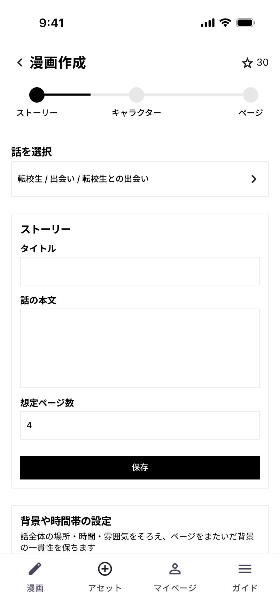

| 項目 | 内容 |
|------|------|
| 対応する指摘 | 2.1 / 3.3（入力欄の基準）／3.5（次工程への案内）／4.3（キャラ設定への導線分断）／5.1 |
| 優先度 | 高 |

**変更点**
- ステップインジケーターを配置（`ストーリー` → `キャラクター` → `ページ`）
- 「話を選択」で対象の話を選択し、現在の対象を常時表示する
- 「ストーリー」セクションに タイトル／話の本文／想定ページ数（初期値4）を配置
- 各入力欄にプレースホルダーで記述例を提示する
- 「背景や時間帯の設定」に説明文を併記（話全体の場所・時間・雰囲気をそろえ、ページをまたいだ背景の一貫性を保ちます）

**設計意図**
下部ナビで分断されていた制作工程を1画面に統合し、ステップインジケーターで現在地と残り工程を可視化する。工程に順序があるという情報が、UI上で表現される状態になる。

入力欄のプレースホルダーは、期待する記述粒度と分量を伝えるためのものである。現状は上限文字数（200 / 8000）のみが提示されており、実際にどの程度書くべきかを利用者が判断できない。記述例を示すことで、出力品質が利用者の記述スキルに依存する状態を緩和する。

「背景や時間帯の設定」に説明文を付与し、この設定が何のためのものか（ページをまたいだ一貫性）を入力前に伝える。

**根拠**
- Nielsen のユーザビリティ10原則「システム状態の可視性」：現在地と進行状況を常時提示する
- 目標勾配効果（Hull 1932）：残距離が知覚できる場合、目標に近づくほど行動意欲が上昇する
- 空欄の入力欄は記入内容の手がかりを提供しない。入力例の提示は記入完了率を向上させる
- 認知負荷理論（外在性負荷）：入力形式の推測に費やされる認知資源を削減する

**補足：プレースホルダーの限界**
プレースホルダーは入力を開始すると消えるため、記入途中で参照できない。記述例を継続的に参照させたい場合は、入力欄の下に補助テキストとして常時表示する方式を併用する。

---

### 4.2 AIストーリー改善（ステップ1／補助機能）

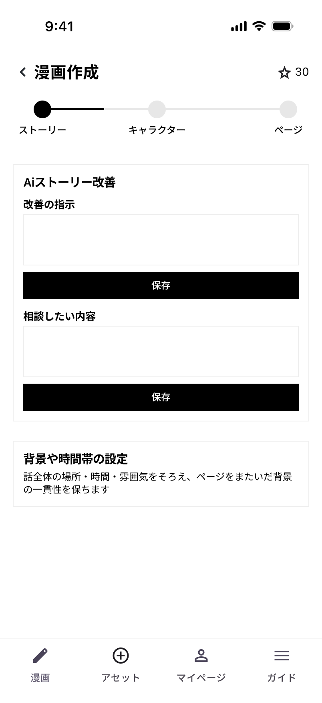

| 項目 | 内容 |
|------|------|
| 対応する指摘 | 3.3（入力の基準がない）への補完 |
| 優先度 | 普通 |

**変更点**
- 「AIストーリー改善」セクションを配置
- `改善の指示`（入力欄＋保存）／`相談したい内容`（入力欄＋保存）の2項目

**設計意図**
3.3 の指摘に対し、プレースホルダーによる例示とは別の経路として、AIに相談しながら入力を進められる導線を用意する。記述に慣れていない利用者が、白紙の状態から書き始めなくて済む。

**根拠**
- 制約による設計（Norman）：自由入力は制約が最小の状態にあたり、支援がない場合に誤りと停滞を生む
- 支援的な入力補助は、習熟度の差による出力品質のばらつきを縮小する

**検討事項**
- 保存ボタンが2つ並置されており、いずれもプライマリースタイルである。2.2（プライマリーは1画面1つ）との整合を確認する必要がある
- 本機能の実行にトークンを消費する場合、消費量の事前提示が必要となる（5.1と同様の構造）

---

### 4.3 アセット一覧（ステップ2）

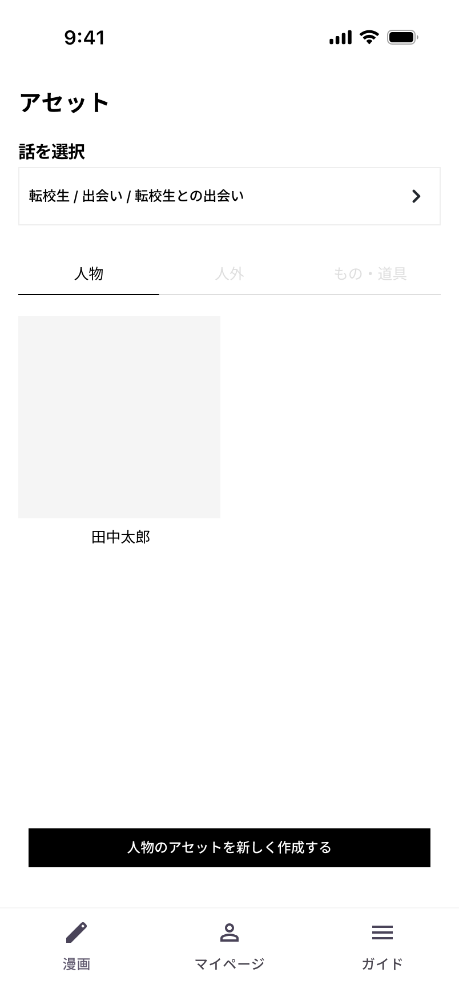

| 項目 | 内容 |
|------|------|
| 対応する指摘 | 4.3（キャラクター設定への導線が分断されている）／5.2 |
| 優先度 | 高 |

**変更点**
- キャラクター設定を「アセット」として独立したタブに配置する
- タブで種類を切り替える（`人物` / `人外` / `もの・道具`）
- 「話を選択」で、どの話に紐づくアセットかを明示する
- 一覧はサムネイル＋名称のグリッド表示
- 画面下部に `人物のアセットを新しく作成する`（プライマリー）

**設計意図**
現状、キャラクター設定は話ごとの入力項目として扱われている。これを「アセット（資産）」として独立させることで、一度作成したキャラクターを話をまたいで再利用できる構造にする。

この変更は、長編制作という訴求に対応する。話数が増えるほどキャラクターを作り直すコストが積み上がる構造では、長編に至らない。アセット化により、2話目以降の制作コストが1話目より低くなる。

種類をタブで分けることで、人物以外の要素（背景に登場する物、道具など）も同一の枠組みで管理できる。

**根拠**
- 情報アーキテクチャにおける構造の一致：再利用される対象は、利用される文脈ではなく対象自身の階層で管理する
- 近接の法則（ゲシュタルト）：関連する要素は近接して配置することで関係性が知覚される
- 一貫性の担保：同一のアセットを参照することで、生成物の一貫性が構造的に保証される（軸C）

---

### 4.4 人物アセット作成

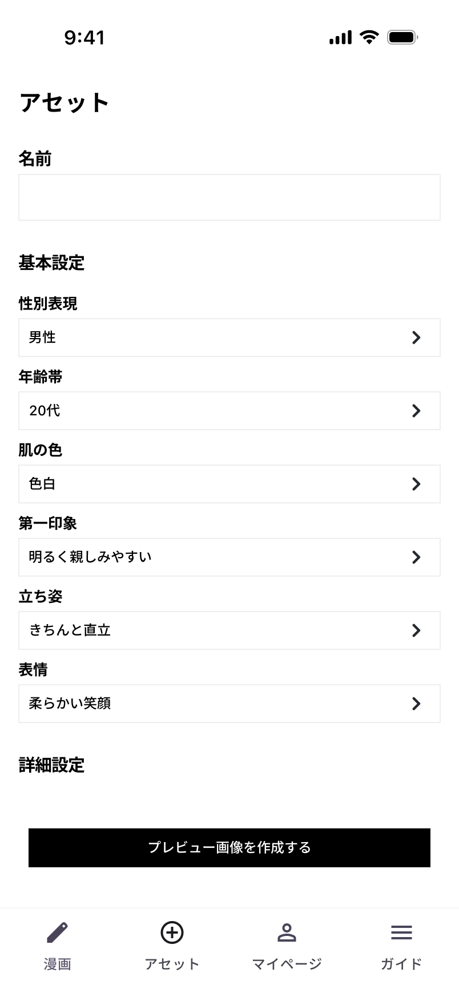

| 項目 | 内容 |
|------|------|
| 対応する指摘 | 4.1（外見設定の項目数が多く既定値が用意されていない）／3.3 / 5.2 |
| 優先度 | 高 |

**変更点**
- 「基本設定」の全項目に**初期値を設定**する（性別表現＝男性／年齢帯＝20代／肌の色＝色白／第一印象＝明るく親しみやすい／立ち姿＝きちんと直立／表情＝柔らかい笑顔）
- 「詳細設定」は初期状態で**折りたたむ**
- 名前欄にプレースホルダーで記述例を提示する
- `プレビュー画像を作成する` をプライマリーとして画面下部に配置

**設計意図**
現状は全項目が「-」（未選択）であり、生成に到達するまでに多数の選択操作が必要となる。基本設定に妥当な初期値を入れることで、**何も設定しなくても生成できる状態**をつくる。利用者は変更したい項目だけを触ればよい。

詳細設定（顔の形・目の形・髪の長さ等）は初期状態で折りたたみ、必要な利用者だけが展開する構成とする。制作の主目的は物語を漫画にすることであり、外見の細部設定は手段にあたる。手段側の負荷を初期状態では発生させない。

**根拠**
- 既定値の効果（デフォルト効果）：適切な初期値の設定により操作数を大幅に削減できる。全項目が未選択の状態では、この効果が得られていない
- プログレッシブ・ディスクロージャー：詳細設定は初期状態で折りたたみ、必要な利用者のみが展開する
- 意思決定疲労（decision fatigue）：連続した選択により判断の質が低下し、中断・離脱が生じやすくなる
- Hick の法則：選択肢数の増加に伴い意思決定時間が増加する

---

### 4.5 人物アセット作成（詳細設定を展開）

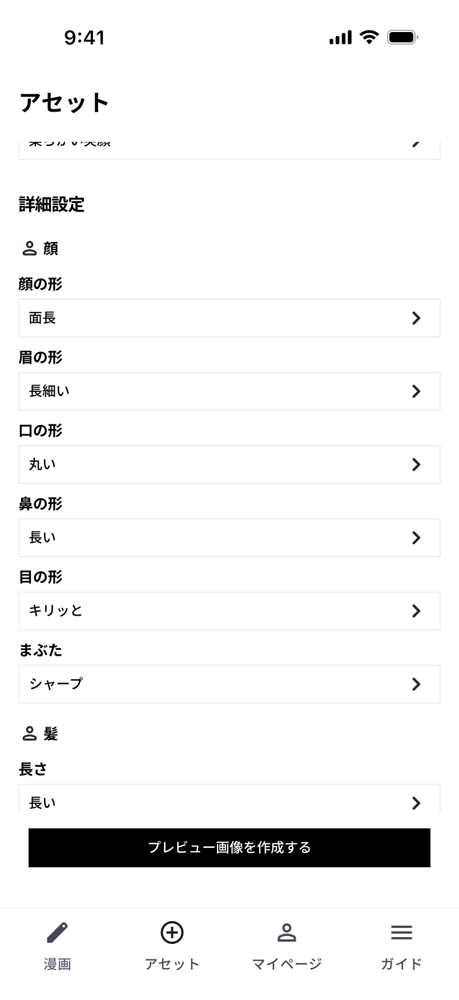
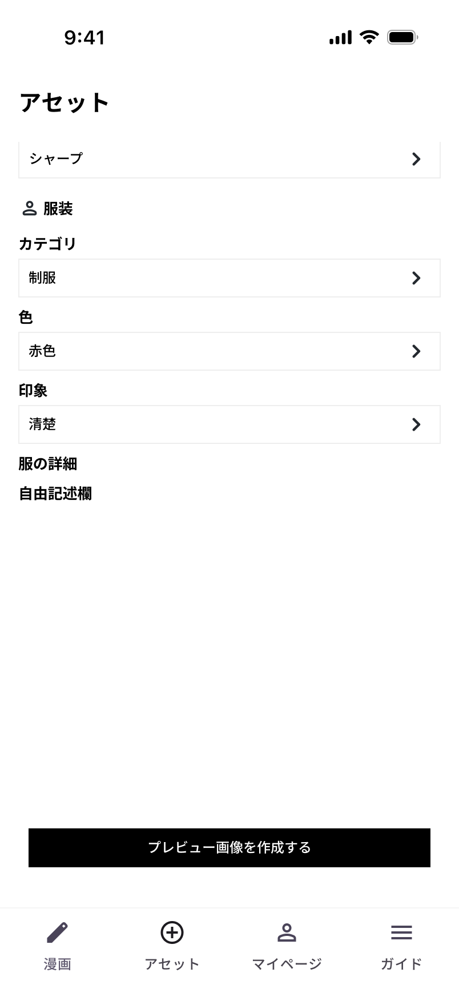

| 項目 | 内容 |
|------|------|
| 対応する指摘 | 4.1 |
| 優先度 | 高 |

**変更点**
- 詳細設定をカテゴリ単位で折りたたむ（`顔` / `髪` / `服装`）
- 展開時、各項目にも初期値を設定する（顔の形＝面長／眉の形＝長細い／口の形＝丸い／鼻の形＝長い／目の形＝キリッと／まぶた＝シャープ／髪の長さ＝長い／カテゴリ＝制服／色＝赤色／印象＝清楚）
- 服装には「服の詳細」「自由記述欄」を設け、選択肢で表現しきれない指定を補完する

**設計意図**
詳細設定を開いた利用者にも、未選択の状態は提示しない。初期値が入った状態から差分を編集する形にすることで、全項目を埋める必要をなくす。

カテゴリ単位の折りたたみにより、設定したい部位だけを開いて編集できる。全項目が縦に連続する現状と比べ、目的の項目への到達が速くなる。

自由記述欄は、リスト選択では表現できない特徴（傷跡、アクセサリー、癖のある着こなし等）を指定するために用意する。

**根拠**
- プログレッシブ・ディスクロージャー
- 既定値の効果
- 制約と自由度の両立：選択式で品質を担保しつつ、自由記述で表現の幅を確保する

**検討事項**
- 自由記述欄のプレースホルダー文言は未確定。4.1と同様、期待する記述粒度を例示する必要がある

---

### 4.6 人物アセット編集

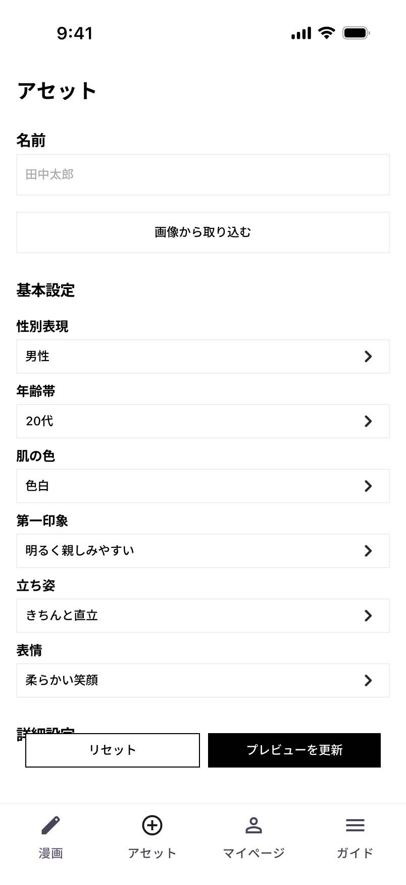

| 項目 | 内容 |
|------|------|
| 対応する指摘 | 5.2（ボタンの優先順位） |
| 優先度 | 普通 |

**変更点**
- 作成済みアセットの編集画面。既存の設定値が入った状態で表示される
- `画像から取り込む` をセカンダリーボタンとして配置する
- 画面下部に `リセット`（セカンダリー）／`プレビューを更新`（プライマリー）

**設計意図**
`画像から取り込む` は、既存の画像を元にアセットを作成する経路である。ただし主たる導線は設定項目からの生成であるため、視覚的な優先度を下げてセカンダリーとする。

編集画面では `プレビューを更新` をプライマリーとし、変更を反映する操作を推奨行動として示す。

**根拠**
- 視覚的階層：要素の視覚的強度は重要度と対応させる
- Material Design：1画面あたりのプライマリーアクションは原則1つとする

**確認事項**
作成画面（4.4）には `画像から取り込む` が配置されていない。作成時にも同ボタンを設ける想定か、編集時のみとするかを確定する必要がある。

---

### 4.7 ページ設計（ステップ3-1）

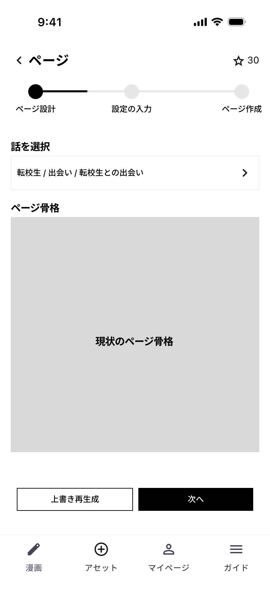

| 項目 | 内容 |
|------|------|
| 対応する指摘 | 2.1 / 3.5 / 5.2（同一スタイルのボタンが並置され優先順位が伝達されない） |
| 優先度 | 高 |

**変更点**
- ページ工程内に入れ子のステップインジケーターを配置（`ページ設計` → `設定の入力` → `ページ作成`）
- **現状のページ骨格をプレビュー表示する**
- `上書き再生成`（セカンダリー）／`次へ`（プライマリー）

**設計意図**
現状は、ページ骨格がどうなっているかを確認する手段がないまま操作を選ぶ必要がある。現状のページ骨格を表示することで、再生成すべきか次へ進むべきかを、利用者が根拠を持って判断できる。

`上書き再生成` と `次へ` は、現状ではいずれも同一のプライマリースタイルで並置されている。標準的な進行は「確認して次へ」であり、再生成は必要な場合のみ行う操作にあたる。そのため `次へ` をプライマリー、`上書き再生成` をセカンダリーとする。

**根拠**
- Nielsen のユーザビリティ10原則「システム状態の可視性」：現在の状態を提示したうえで判断させる
- 視覚的階層：推奨する行動に高い視覚的強度を与える
- Hick の法則：同等の強度を持つ選択肢の並置は意思決定時間を増加させる

---

### 4.8 設定の入力（ステップ3-2）

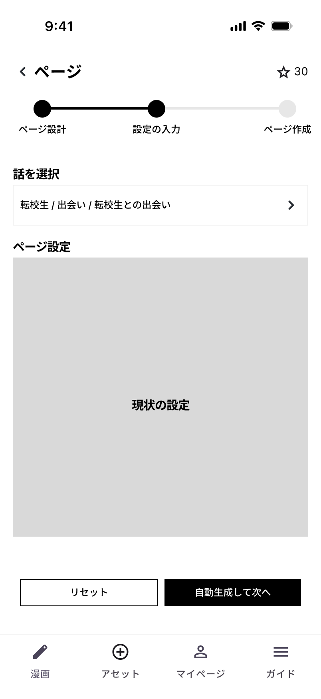

| 項目 | 内容 |
|------|------|
| 対応する指摘 | 5.2 |
| 優先度 | 普通 |

**変更点**
- **現状のページ設定をプレビュー表示する**
- `リセット`（セカンダリー）／`自動生成して次へ`（プライマリー）
- ステップインジケーターの2番目が進行状態を示す

**設計意図**
4.7 と同じ構造。現在の設定内容を確認したうえで、自動生成に進むかリセットするかを判断できるようにする。

**根拠**
- Nielsen のユーザビリティ10原則「システム状態の可視性」
- Nielsen のユーザビリティ10原則「一貫性と標準化」：ステップ間で画面構成とボタン配置を統一する

---

### 4.9 ページ一覧（ステップ3-2／カルーセル）

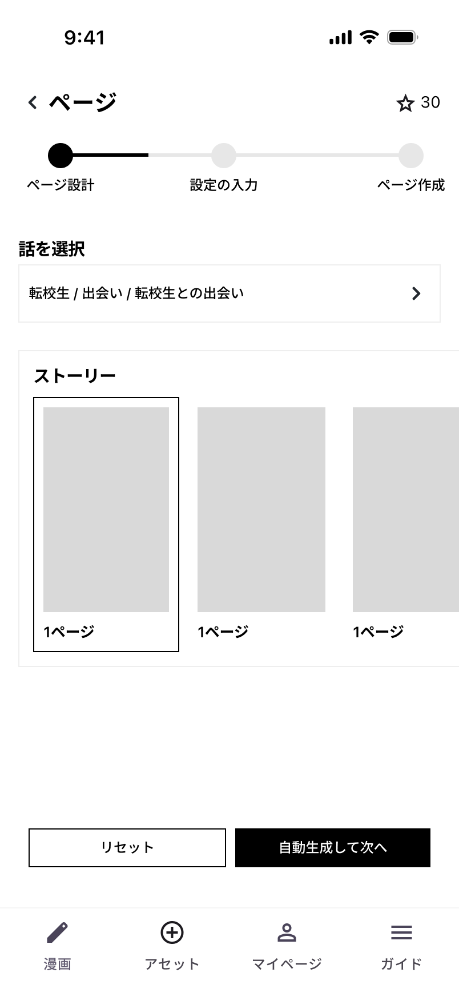

| 項目 | 内容 |
|------|------|
| 対応する指摘 | （新規改善／指摘との直接対応なし） |
| 優先度 | 普通 |

**変更点**
- ページ一覧を**横スクロールのカルーセル**で表示する
- 選択中のページを枠線で示す
- 各ページに「1ページ」等のラベルを付与する

**設計意図**
カルーセルは、右端の要素を意図的に見切れさせることで「続きがある」ことを視覚的に伝える。縦積みのリストと比べ、複数ページを持つ作品であることが一覧の時点で認識できる。

**根拠**
- スクロール手がかり（scroll affordance）：要素を画面端で見切れさせることで、続きの存在を示唆する
- ゲシュタルトの法則（連続）：同一方向に並ぶ要素は一続きのものとして知覚される

**検討事項**
ページ数が多い長編では、カルーセルでの横走査が長くなる。一定数を超えた場合にグリッド表示へ切り替える等の対応を検討する必要がある。

---

### 4.10 生成結果（ステップ3-3）

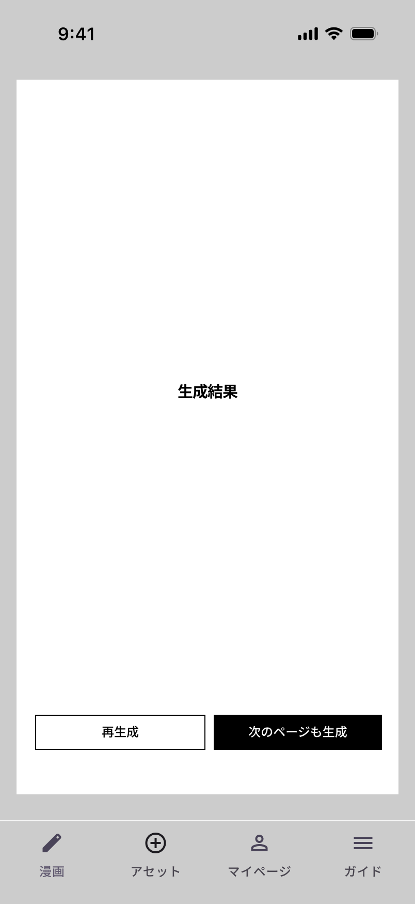

| 項目 | 内容 |
|------|------|
| 対応する指摘 | （新規改善／指摘との直接対応なし） |
| 優先度 | 高 |

**変更点**
- 生成完了時、結果を**ダイアログとして即座に表示する**
- `再生成`（セカンダリー）／`次のページも生成`（プライマリー）

**設計意図**
現状は、生成結果を確認するために画面を下までスクロールする必要があった。生成には時間を要するため、完了したことと結果の両方が、利用者の操作なしに提示される必要がある。

ダイアログとして前面に表示することで、生成完了の通知と結果の提示を同時に行う。続けて `次のページも生成` を配置し、長編制作の連続性を担保する。

**根拠**
- Nielsen のユーザビリティ10原則「システム状態の可視性」：処理の完了は明示的に通知する
- 応答時間の閾値（Nielsen / Miller）：長時間の処理では完了通知が必須となる
- 完了後の次行動の提示：連続作業では、次の操作を同一画面で提供することで継続率が向上する

---

## 5. 改善案が生み出す構造的な変化

個別の改善に加え、本改善案は次の構造的な変化をもたらす。

### 5.1 制作工程が1本の線になる

現状は、下部ナビの3タブを利用者が順序を推測しながら行き来する構造だった。改善案では以下の入れ子のステップとして表現される。

```
漫画タブ
 └ ストーリー ─→ キャラクター ─→ ページ
                                  └ ページ設計 ─→ 設定の入力 ─→ ページ作成
```

各画面に現在地と次の操作が表示されるため、利用者が順序を記憶・推測する必要がなくなる。

### 5.2 2話目以降のコストが下がる

キャラクターをアセットとして独立させたことで、一度作成した設定を話をまたいで再利用できる。話数が増えるほど設定作業が積み上がる現状の構造に対し、改善案では1話目に作った資産が2話目以降で効く構造になる。

これは「長編漫画制作」という訴求に直接対応する変更である。

### 5.3 トークンの存在が前提として共有される

全画面のヘッダーに残高を常時表示することで、トークンを消費するサービスであることが利用開始時点から認識される。現状のように、制作作業を完了した後に初めて残高を知る状況が発生しない。

---

## 6. 指摘と改善案の対応表

| 指摘ID | 指摘 | 優先度 | 対応する改善案 | 状態 |
|--------|------|--------|--------------|------|
| 2.1 | 制作手順の提示が制作中のUIと接続されていない | 高 | 3.1 チュートリアル／4.1 ステップインジケーター | ✅ 対応 |
| 3.1 | 空状態に次の操作へ進むボタンが存在しない | 高 | 3.2 漫画一覧（空状態） | ✅ 対応 |
| 3.2 | 右上のアクションボタンがステータスバーと重なる | 高 | 3.2 主要ボタンを画面下部へ移動 | ✅ 対応 |
| 3.3 | 入力欄に記述粒度と分量の基準が示されていない | 高 | 4.1 プレースホルダー／4.2 AIストーリー改善／4.4 初期値 | ✅ 対応 |
| 3.5 | 次工程への案内がテキストのみで遷移できない | 高 | 4.1 / 4.7 / 4.8 ステップ進行とプライマリーボタン | ✅ 対応 |
| 4.1 | 外見設定の項目数が多く既定値が用意されていない | 高 | 4.4 基本設定の初期値／4.5 詳細設定の折りたたみ | ✅ 対応 |
| 4.3 | キャラクター設定への導線が分断されている | 高 | 2.1 ナビ構造変更／4.3 アセット化 | ✅ 対応 |
| 5.1 | トークンの残高・消費量が生成直前まで提示されない | 高 | 2.2 全画面ヘッダーへの常時表示 | ⚠️ 一部対応 |
| 5.2 | 同一スタイルのボタンが並置され優先順位が伝達されない | 普通 | 2.2 / 4.6 / 4.7 / 4.8 ボタン階層の整理 | ✅ 対応 |
| 2.4 | 言語切替が使用頻度に対して高い視認性を持つ | 低 | ワイヤー上で各画面から除去（移動先は要確定） | ⚠️ 一部対応 |
| 3.4 | エラー表示に失敗内容・原因・未保存内容が含まれない | 高 | ー | ⬜ 保留 |
| 3.6 | 未保存状態の通知が選択肢の結果を明示しない | 普通 | ー | ⬜ 保留 |
| 5.3 | 生成所要時間が説明文中に埋没している | 普通 | ー | ⬜ 保留 |
| 5.4 | 生成結果のコマ割りの強弱が弱い | 普通 | ー | ⬜ 別途対応 |
| 2.2 | 認証画面のドメインがブランドと一致しない | 普通 | ー | ⬜ 別途対応 |
| 2.3 | 認証メールに送信理由・用途・有効期限の記載がない | 普通 | ー | ⬜ 別途対応 |
| 4.2 | 選択肢の並び順が使用頻度に対応していない | 低 | ー | ⬜ 保留 |

**対応状況：17件中 9件が対応、2件が一部対応、6件が保留または別途対応**

---

## 7. 改善案でカバーしていない指摘

以下は、現時点で仕様が確定していないため改善案に含めていない。いずれも指摘は有効であり、別途対応を要する。

### 7.1 保留（仕様の確認が必要）

| 指摘ID | 指摘 | 保留の理由 | 対応に必要な情報 |
|--------|------|-----------|----------------|
| 3.4 | エラー表示の内容不足 | エラーの種別と、システム側で判別可能な原因の範囲が不明なため | 発生しうるエラーの一覧、各エラーで特定可能な原因、トークン消費の発生条件 |
| 3.6 | 未保存状態の通知が選択肢の結果を明示しない | 未保存データの保持範囲・復旧仕様が不明なため | 未保存入力の保持単位、「最新状態を読み込み」で置き換わる対象 |
| 5.3 | 生成所要時間が説明文中に埋没している | ページ数と所要時間の関係が不明なため | ページ数ごとの所要時間の実績値、進捗の取得可否 |
| 4.2 | 選択肢の並び順が使用頻度に対応していない | 全選択肢の一覧と利用実績が不明なため | 各カテゴリの選択肢一覧、選択頻度のデータ |

### 7.2 別途対応（UI設計の範囲外）

| 指摘ID | 指摘 | 対応の領域 |
|--------|------|-----------|
| 2.2 | 認証画面のドメインがブランドと一致しない | 認証基盤の設定。認証ホストに自社ブランドのサブドメインを割り当てる |
| 2.3 | 認証メールに送信理由・用途・有効期限の記載がない | メールテンプレートの改修。UIワイヤーの対象外 |
| 5.4 | 生成結果のコマ割りの強弱が弱い | 生成ロジックおよびプロンプト設計。UI改善と独立して進行可能 |

### 7.3 一部対応

| 指摘ID | 指摘 | 未対応の部分 |
|--------|------|------------|
| 5.1 | トークンの残高・消費量 | 残高の常時表示は対応済み。**各工程で必要な消費量の事前提示**は未対応。残高不足時の警告と補充導線も未設計 |
| 2.4 | 言語切替の視認性 | ワイヤー上では各画面から除去されているが、**移動先（マイページ／ガイドのいずれか）が未確定** |

---

## 8. 実装順序の提案

| 順序 | 対象 | 理由 |
|------|------|------|
| 1 | 3.2（右上ボタンの配置）／5.1（残高の常時表示） | 単独で対応可能かつ影響が大きい。大規模な設計変更を伴わない |
| 2 | 2.1 ナビゲーション構造の変更／4.1〜4.10 制作フローの統合 | 本改善案の中核。指摘2.1 / 3.1 / 3.3 / 3.5 / 4.1 / 4.3 / 5.2 が一括で解消される |
| 3 | 4.3〜4.6 アセット化 | 上記と同時に実施する。長編制作（軸D）への対応にあたる |
| 4 | 7.1 の保留項目 | 仕様確認後に着手する |
| 5 | 7.2 の別途対応項目 | 認証基盤・生成ロジックの領域。UI改善と並行して進行可能 |

---

## 9. 未検証・未設計の領域

本改善案は、検証済みの画面に対する提案である。以下は設計に含まれていない。

- マイページタブの内容
- ガイドタブの内容（チュートリアルの本編）
- 生成中の進行表示
- トークンの購入・残高確認画面
- 残高不足時の挙動
- エラー発生時の画面
- 「人外」「もの・道具」アセットの入力項目
- 複数作品・複数話を横断する管理画面（軸D：長編管理）
